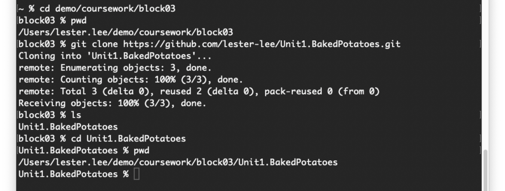

cls
# Baked Potatoes

Let's practice making changes in a local Git repository and syncing those changes to a remote repository on GitHub. By the end, you'll have a recipe for baked potatoes in your own GitHub repository!

## Use this repository as a template

Notice that you're currently already viewing a repository on GitHub! This repository is a **template** repository, which means you can use it as a starting point for your own repository. This is how you'll be getting starter code for the rest of the course.

1. Click the green **Use this template** button near the top of the page. This will take you to a page where you can create a new repository based on this template.
   
2. In the **Owner** dropdown, select _your own_ GitHub account.

> [!WARNING]
> Do not leave the owner as **FullstackAcademy**!

3. Copy the original **Repository name** into the text field. In this case, it's **Unit1.BakedPotatoes**.
   1. You can change the name if you want, since it's your repository now!
4. Select **Public** as your repository visibility.
5. Click the green **Create repository** button. You will be redirected to the main page for your new repository.
6. Confirm that you are viewing the correct repository by checking the repository name in the top-left corner of the page. You should see the status "generated from FullstackAcademy/Unit1.BakedPotatoes".


> See: [creating a repository from a template](https://docs.github.com/en/repositories/creating-and-managing-repositories/creating-a-repository-from-a-template#creating-a-repository-from-a-template)

## Clone down your repository

The repository has been created on GitHub, but now we need to bring it down to your own computer!

1. Click the green **Code** button near the top of the page. This will reveal a URL that you can use to clone the repository.
2. Confirm that you are on the **HTTPS** tab.
3. Click the clipboard icon to copy the URL to your clipboard.


4. Create a `block03` folder in your `coursework` directory and navigate your terminal to it.
5. Confirm you are in the correct directory with `pwd`. You should see `coursework/block03` at the end of the output.
6. Clone the repository down by running `git clone <url>`, where `<url>` is replaced with the URL that you copied earlier.
7. `ls` to confirm that the repository has been cloned down. You should see a new directory with the same name as your repository.
8. `cd` into the repository directory.



> See: [cloning a repository](https://docs.github.com/en/repositories/creating-and-managing-repositories/cloning-a-repository#cloning-a-repository)

## Make changes to the repository

Now that you have the repository on your computer, let's open the folder in VS Code and make some changes!

1. Open the repository in VS Code.

> [!TIP]
>
> You can launch VS Code directly from the terminal by running `code .` in the repository directory!
> See: [launching from command line ](https://code.visualstudio.com/docs/editor/command-line#_launching-from-command-line)

2. Open the `recipe.md` file. It should currently be empty.
3. Copy the following text into the file and save.

   ```md
   # Baked Potatoes

   Learn how to make perfect baked potatoes! This recipe is simple and delicious.
   ```

4. Your changes are saved, but you haven't told Git to track them yet. You'll need to run some terminal commands to do that. Open an integrated terminal in VS Code by selecting **Terminal** > **New Terminal** from the menu.
5. In the VS Code terminal, run `git status` to see the status of your changes. Notice that `recipe.md` has been modified and listed either as an untracked file or as changes not staged for commit.
6. Run `git add recipe.md` to add the changes to the **staging area**.
7. Run `git status` again. You'll now see `recipe.md` listed under "Changes to be committed".
8. Run `git commit -m "Write recipe introduction"` to commit the staged changes to the repository with the message "Write recipe introduction".

Congrats! You've successfully committed some changes to a local repository!

> [!NOTE]
> Commit messages should be concise and descriptive to help you and others understand the history of the repository. As a general rule of thumb, they should complete the sentence: "The changes in this commit will..."

## Rinse and repeat

Let's make a few more changes for practice!

1. Add the following text to `recipe.md` and commit the changes with the message "Add ingredients list".

   ```md
   ## Ingredients

   - 1 large potato
   - Cooking oil
   - Salt
   ```

2. Add the following text to `recipe.md` and commit the changes with the message "Write instructions".

   ```md
   ## Instructions

   1. Preheat the oven to 425°F.
   2. Wash and scrub the potato.
   3. Pat the potato dry with a paper towel.
   4. Use a fork to poke holes all over the potato.
   5. Rub the potato with cooking oil.
   6. Sprinkle salt generously over the potato.
   7. Bake the potato for 45-60 minutes.
   ```

3. Run `git log` to see the commit history of the repository. You should see the three commits that you've just made.

## Push your changes to GitHub

Your local repository now has a complete recipe for baked potatoes, but the changes are not yet reflected on GitHub. Let's push the changes to the remote repository!

1. Run `git push` to push the changes to GitHub.

That's it! If you visit your repository on GitHub, you should see the changes that you've made.
